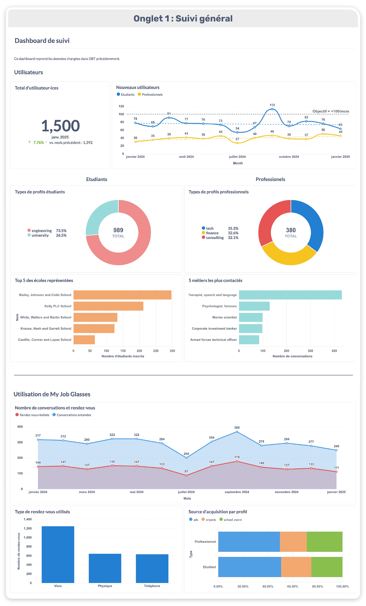
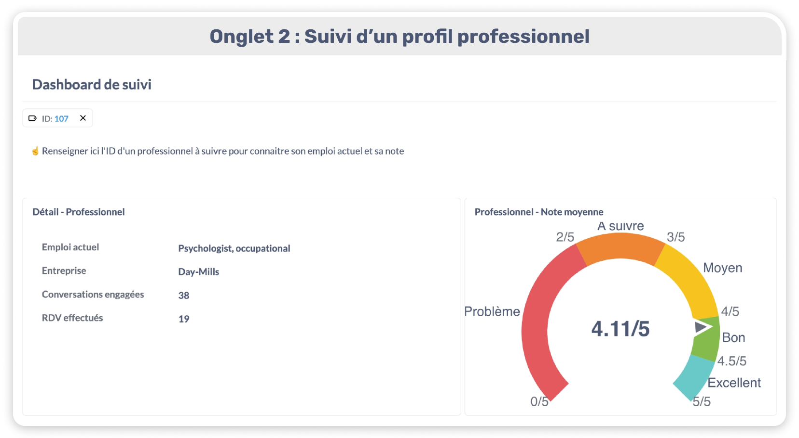

Bienvenue sur mon étude de cas pour le rôle de Data Analyst chez My Job Glasses !

# Objectif

Ce test a pour but d’évaluer ma capacité à :
- Modéliser et analyser des données avec dbt
- Ecrire du SQL robuste et lisible
- Détecter et traiter des problèmes de qualité des données
- Produire des insights business et des dashboards clairs

Les données disponibles représentent le marché principal de My Job Glasses, où des étudiants entrant en contact avec des professionnels pour discuter de leur carrière. Elles sont composées de 5 tables : schools, users, professional_profiles, conversations, appointments.

# Lancer le projet

## 1. Installer les librairies nécessaires
    pip install -r requirements.txt

## 2. Lancer dbt
Exécuter les commandes `dbt seed` puis `dbt run`

## Visualisation avec Metabase
Pour la partie visualisation, j'ai utilisé Metabase pour être au plus proche de la stack utilisée chez My Job Glasses.

- Prérequis : avoir installé et lancé Docker
    
- Construction de l'image :
    _Conseil : faire ces étapes dans un dossier séparé_

        git clone https://github.com/motherduckdb/metabase_duckdb_driver.git
        cd metabase_duckdb_driver
        docker build -t metabase_duckdb .

- Lancement : 
    _Se replacer dans le dossier dbt, au même endroit que le fichier database.duckdb_

        docker run -d -p 3000:3000 \
        --name metabase_mjg \
        -v "$(pwd)/database.duckdb:/home/metabase/repository/database.duckdb" \
        metabase_duckdb

- Configuration Metabase :
    Une fois l'initialisation finie (cette étape peut prendre quelques minutes) vous aurez accès à Metabase sur l'adresse http://localhost:3000
    Vous devrez ensuite configurer votre base DuckDB avec les informations suivantes :

    |   Paramètre               |   Valeur  |
    |   ----------              |   :----------:    |
    |   Type de base de données |	DuckDB  |
    |   Nom d'affichage         |	_au choix_  |
    |   Path                    |	/home/metabase/repository/database.duckdb   |
    |   Détails additionnels    |	Cocher "Read-only"  |

# Choix réalisés

## dbt
- **Format de données**
J'ai choisi d'utiliser **DuckDB** par soucis de rapidité et de simplicité. Ca m'a permis de créer une base de données en stockant simplement les CSV que j'avais reçus dans des fichiers seed.
- **Modélisation**
    - **Staging** - J'ai utilisé cette étape pour renommer des colonnes uniquement. Le reste des colonnes sont déjà aux bons format (dates/texte/numérique) et ne nécessitent pas de modification particulière.
    - **Intermediate** - J'ai proposé 2 vues pouvant servir de raccourci pour des jointures dans de futures requêtes, afin d'éviter des répétitions.
    - **Mart** - J'ai représenté les 3 tables demandées dans l'énoncé :
        monthly_funnel : suivi mensuel de plusieurs indicateurs principaux
        professionals_usage : utilisation de l'outil par chaque étudiant
        students_usage : utilisation de l'outil par chaque professionnel
    - **Tests** - J'ai mis en place 2 types de tests : 
        Dans le fichier schema.yml, pour m'assurer que chaque ligne ait un identifiant unique, non null. Cela m'a permit de voir qu'il y avait une ligne dupliquée dans la table conversations (id=11) puis de la nettoyer manuellement en supprimant ce doublon. En ajoutant des dépendances à dbt, on pourrait également vérifier que la table n'est pas vide.
        Dans un fichier de test, pour vérifier l'unicité d'un profil professionnel. On ne veut pas d'un professionnel sans descriptif de son emploi, et un professionnel ne peut avoir qu'un seul emploi.

## Metabase
Pour que cet exercice soit plus interactif, j'ai connecté Metabase aux données créées sur dbt. L'image docker utilisée n'est pas officielle et sera peut-être amenée à évoluer.
J'ai regroupé mes données dans un dashboard principal, qui pourrait servir d'indicateur principal ou de page d'accueil par exemple. Les graphiques sont organisés en rubriques : 
1. **Utilisateurs**
    - Suivre l'attractivité de l'outil en affichant le total d'utilisateurs, qu'ils soient étudiants ou professionnels.
    - Rubrique étudiants : suivi des écoles les plus présentes sur l'outil et leur spécialité. 
    - Rubrique professionnels : suivi des types de profils présents et des profils les plus attractifs auprès des étudiants.
    - Remarque : dans cet exemple, nous manquons de diversité pour se rendre vraiment compte de l'intérêt du suivi des profils, mais à grande échelle, ca aiderait à guider l'exhaustivité de l'outil et la sur/sous-représentation de certains secteurs.
2. **Utilisation de My Job Glasses**
    - Evolution du nombre de communication et rendez-vous organisés en parallèle, pour suivre à la fois le nombre total et le taux de conversion. Pour aller plus loin, nous aurions pu chiffrer ce taux de conversion.
3. **Pour aller plus loin**
    Je vais noter ici des idées d'améliorations de mon dashboard ainsi que des idées pour aller plus loin en prenant davantage de temps :
    - Filtres : des filtres pourraient être utilisés sur les dates voire des filtres dynamiques directement sur les requêtes, pour suivre une période donnée ou des profils par exemple. J'ai appliqué un filtre simple uniquement sur un exemple de suivi détaillé d'un profil professionnel, car ca ne faisait pas sens d'en ajouter sur mon dashboard principal.
    - Utilisation de My Job Glasses dans le temps : on pourrait mesurer l'activité (en nombre de communications par mois) d'un utilisateur moyen, pour évaluer si l'outil reste pertinent et attractif dans le temps.
    - Tunnel de conversion : on pourrait mesurer le nombre total d'utilisateurs (par type), puis le nombre de communications et de rendez-vous réalisés
    - Sankey chart : On pourrait réaliser ce genre de graphique pour voir si le canal d'acquisition des profils professionnels a un impact sur le nombre de communications et de rendez-vous organisés par exemple.

### Screenshots des pages Metabase

## Utilisation d'IA
J'ai utilisé Gemini lorsque j'ai rencontré quelques problèmes/blocages de la configuration de DBT ou de Metabase avec DuckDB. Je n'avais jamais utilisé cette base de données auparavant. Le reste du travail de modélisation, requête et visualisation a été fait par mes soins.